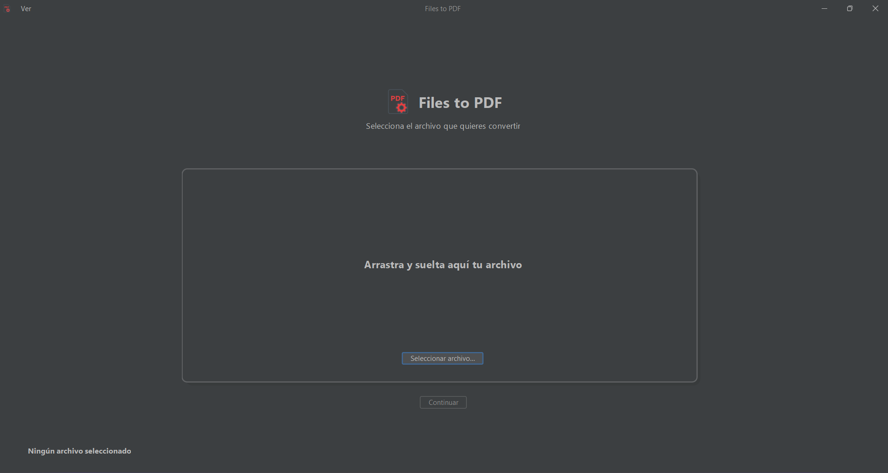
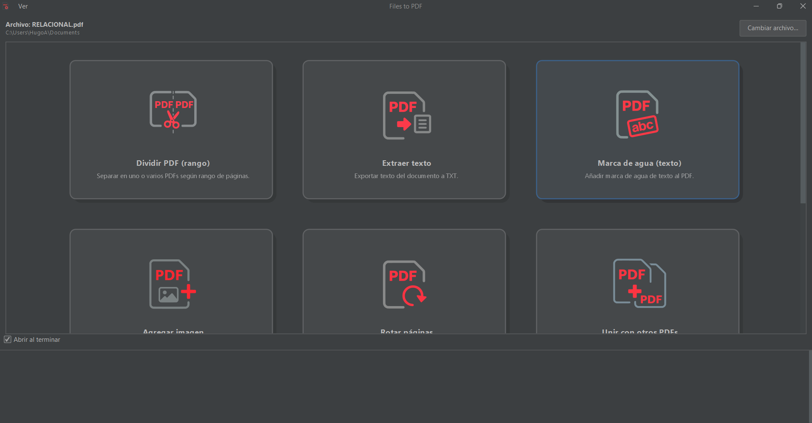

<h1 align="center">🧩 Files to PDF — v1.0.0</h1>

<p align="center">
  Aplicación Java Swing moderna para **crear, unir, dividir y editar archivos PDF**, con interfaz visual basada en <b>FlatLaf</b>, vista previa integrada y herramientas de conversión desde imágenes y Office.
</p>

<p align="center">
  
  

  
  
  
  
  
  <a href="LICENSE"></a>
</p>


---

## 📖 Tabla de contenido
- [📸 Capturas](#-capturas)
- [✨ Características](#-características)
- [📋 Requisitos](#-requisitos)
- [🚀 Descargar / Ejecutar](#-descargar--ejecutar)
- [📂 Estructura del proyecto](#-estructura-del-proyecto)
- [🧰 Roadmap](#-roadmap)
- [🔒 Privacidad](#-privacidad)
- [💡 Inspiración](#-inspiración)
- [👥 Créditos](#-créditos)
- [🤝 Contribuir](#-contribuir)
- [📜 Licencia](#-licencia)
- [⭐ Apóyame](#-apóyame)

---

## 📂 Estructura del proyecto

```plaintext
src/
 ├── main/java/
 │    └── com/mycompany/programa_pdf/
 │         ├── MainWindow.java
 │         ├── PdfPreviewDialog.java
 │         ├── MergePreviewDialog.java
 │         ├── WatermarkPreviewDialog.java
 │         └── ...
 └── resources/
      ├── icons/
      ├── themes/
      └── config/
```
 **Roadmap**

 - Unir / dividir PDFs
 
 - Marcas de agua
 
 - PDF → imágenes
 
 - Office → PDF
 
 - OCR (reconocimiento de texto en imágenes)
 
 - Firmas digitales
 
 - Exportar a PDF interactivo con metadatos

---

 **Privacidad**

Toda la conversión y edición se realiza localmente en tu dispositivo.
No se almacenan ni envían archivos a ningún servidor externo.

---

**Inspiración**

El diseño está inspirado en la simplicidad de PDFsam y la interfaz moderna de LibreOffice Draw, con un enfoque visual propio.

---

**Créditos**

Desarrollado por Hugo Acosta
📍 Mazatlán, Sinaloa — Ugo25
---
**Version**

```bash
Files to PDF 1.0.0 (2025)
```
---
**Contribuir**

Haz un fork del repositorio

Crea una rama con tu cambio:
```bash
git checkout -b feature/nueva-funcion
```
---
**Licencia**

Este proyecto está bajo la licencia Apache 2.0.

---

## 📸 Capturas

| Inicio | Menú principal |
|---|---|
|  |  

*(GIFs próximamente: demostración de arrastrar imágenes → exportar PDF → imprimir)*

---

## ✨ Características

-  **Imágenes → PDF** (múltiples archivos, ordenar/rotar antes de exportar).  
-  **Unir / Dividir PDF** por rango.  
-  **Extraer texto** a TXT.  
-  **Marca de agua (texto o imagen)**.  
-  **Impresión directa** desde la vista previa.  
-  **Zoom y miniaturas** para explorar el documento.  
-  **Office → PDF** mediante LibreOffice (opcional).  
-  **Tema claro/oscuro persistente** entre sesiones.  
-  **Interfaz responsiva** con scroll fluido y diálogos nativos.  

---

## 📋 Requisitos

-  **Java 17+ (JDK)**  
-  **Maven** (para compilar desde código fuente)  
-  **LibreOffice** (solo si usarás la conversión Office → PDF)  

---

## Descargar / Ejecutar

### 🔹 Opción A: Ejecutar desde IDE

```bash
git clone https://github.com/Hugo-Acosta/Files-to-PDF.git
cd Files-to-PDF
mvn clean install
java -jar target/Files-to-PDF-1.0.0.jar
```
---

Apóyame

Si te fue útil, deja una ⭐ en el repositorio y comparte Files to PDF
